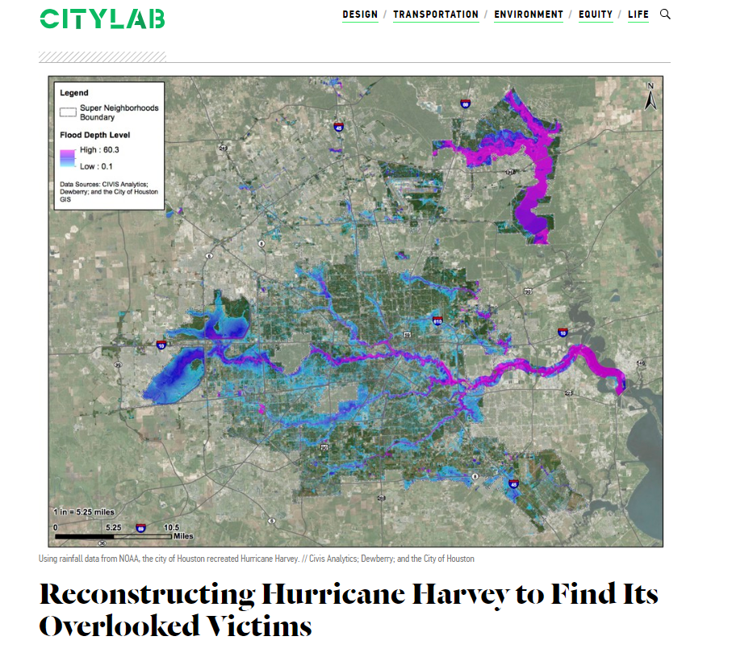
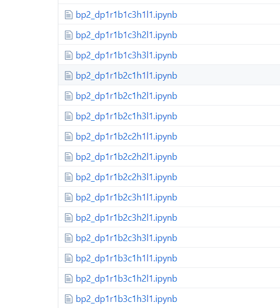
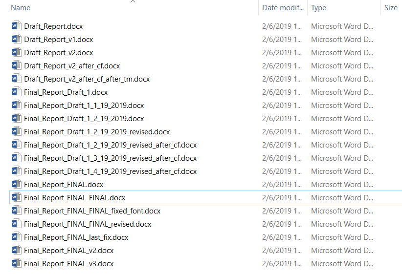

# Jupyter Notebooks
## The Right Tech at the Right Time

[Seth Lawler](slawler@dewberry.com), [Jeff Gangai](jgangai@dewberry.com), [Tyler Miesse](tmiesse@dewberry.com)

### Introduction & Background

 __[Hurricane Harvey: Hindcast__](https://www.citylab.com/environment/2018/10/hurricane-harvey-houston-recovery-aid-federal-funds-fema/573094/)

 

 ---

 __NC Storm Sourge: Production Runs__

 

---

 Why use free, [Open Source Software](https://www.osgeo.org/) when we can buy multiple software products to do the same thing? 

 

 *Looks like you were right. Can’t use field calculator to do what I’m trying to do. I’ll be writing a Python script.*
 [Bill Dolins](http://blog.geomusings.com/2011/05/25/piling-on-about-python)

 ---

 Why do we need [__GIT__](https://github.com)...we already have version control system in place?

 

---

__The Big Question__: Which version of the report was copied to the `Deliverables` folder

---

 Where does  [__Jupyter__](https://www.youtube.com/watch?v=s98IGzlptHw) fit in?

---

[__Presentation__](index.slides.html)

---

[Github](https://github.com/slawler/harvey-hindcast)

[UCARgribs](https://github.com/slawler/raingrids/blob/master/UCARgribs_geotag.ipynb)

